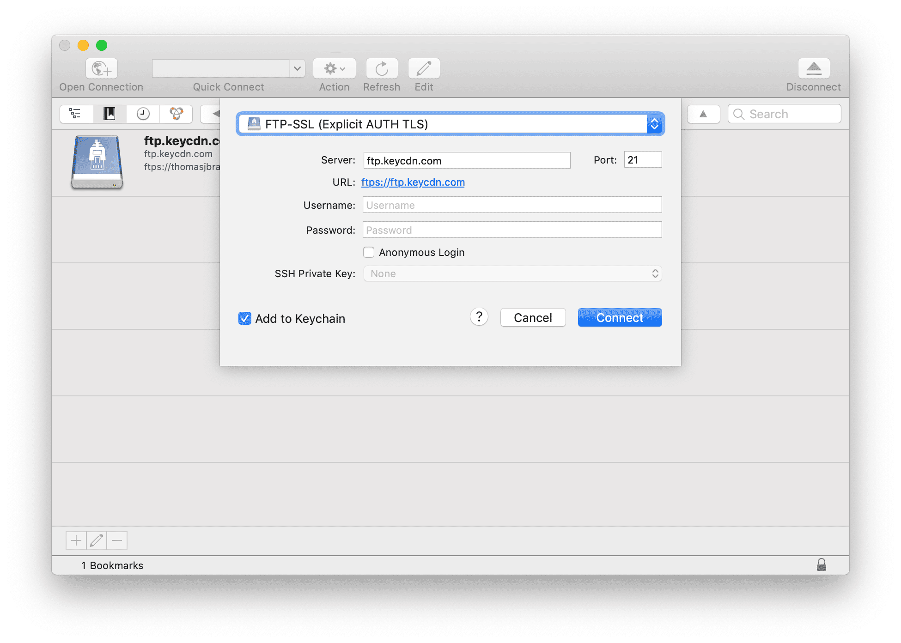

# Algonquin Design Grad Meta

*Documentation about the grad websites in general.*

---

## Wisdom from previous years

- Images will not be stored in the GitHub repository—they’ll be stored in a CDN for better performance. (Credentials will be given out.) There are too many images, they’ll choke up the repository.

- You must make a coming soon page first—we will need to have details about the event’s location way before the website is done.

- The website needs to be launched before your placement. I suggest you have it ready in time for your last Fieldwork/Grad Show class of the term. You can then use some of the class time to get everybody to preview the site and double check all their personal information.

- There are a few different target audiences for the grad website:
  1. The employers themselves: so they can find people to hire
  2. The Graphic Design program: as a show piece for entering into contests, showing off as an example of 3rd-year work, and for potential students to see work from grads
  3. Teachers, who need to send out names of recommended students to employers—we’ll send your page on this website

- Stay on top of everybody else in the class: give them very strict deadlines for giving you their work, with the threat of not being listed on the website. Consider assigning team members to hound and constantly message students who haven’t handed their work in yet.

- When requesting content from your peers be overly specific: exact dimensions for their portfolio pieces, limited character length for their description, limited number of social sites, etc.

- There needs to be a content preparation team: people who take all the junk your peers send and get it ready: format it properly in Markdown, confirm all the images are compress & run through ImageOptim, etc. I often suggest that the Web Team does the portfolio piece compression themselves, for better control, and get your peers to send PSDs.

- The website will be built with Jekyll, each person in class will have their own *.md file with their own details. Using a Jekyll collection, we get the benefit of everybody’s Markdown file generating a page & we can loop through the collection to list them on the website homepage.

- Performance is going to be a problem: really consider how to make the homepage load and display quickly when there are so many photos & videos.

---

## Files on GitHub

These files are allowed in the GitHub repositories.

- HTML, CSS, Javascript
- SVGs, favicons.ico
- Text, Markdown, README

## Files *not* on GitHub

These files cannot go into the GitHub repositories.

- Raster graphics: JPG, PNG, GIF
- Adobe files: AI, PSD, INDD, PDF
- Compressed files: zip, tar, gz
- Type faces: OTF, WOFF, TTF
- Video & audio: mov, m4v, ogv, mp3, m4a, ogg

While working on teams, these files should likely be shared in Dropbox.

When launching the website, these types of files will be uploaded to our CDN: Amazon S3.

---

## KeyCDN—for images, videos, fonts, etc.

For deploying & uploading images & binary assets related to the grad websites.

Use Cyberduck for uploading: <http://cyberduck.io/>

- *URL for images on grad websites*:
  `https://grads.images.algonquindesign.ca/`

**Ask @thomasjbradley for credentials.**

